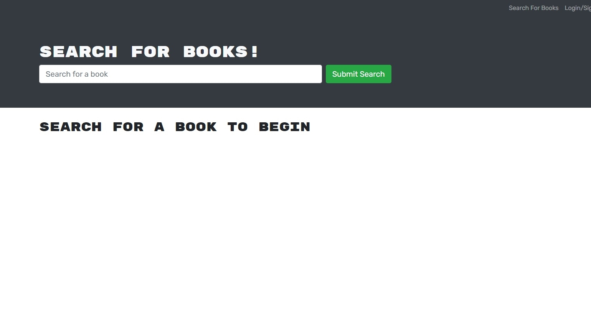
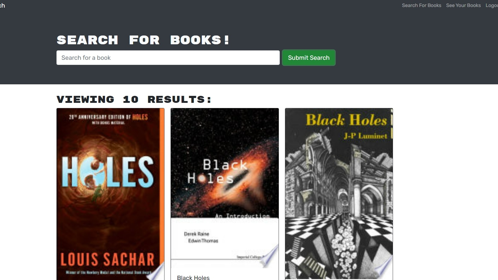
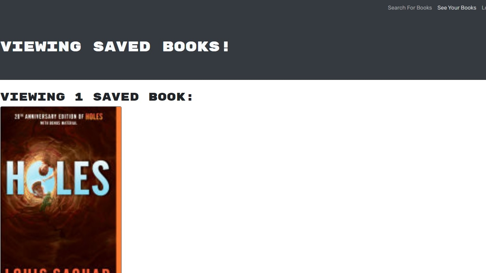
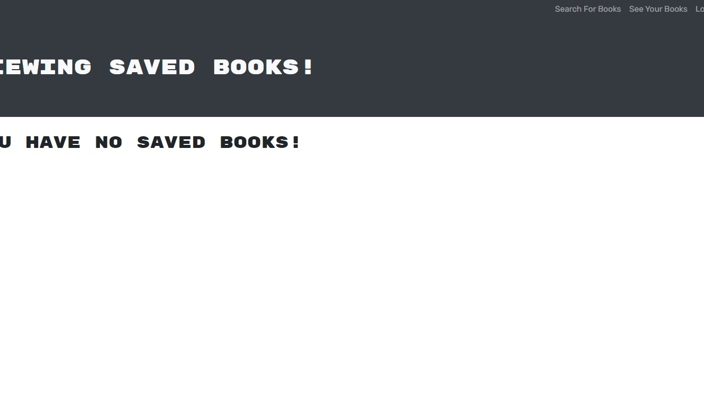

# The Best Book Search Engine

## Description
I made the Best Book Search Engine.

This was an assignment for my boot camp. The code was provided, and I refactored it to become a MERN stack application.

Has a friend ever recommended a book, but you already have a long list of books you want to read. What if there was an application to keep track of all of these wonderful books.

Enter the Best Book Search Engine. Search books you want to read, and save them to a list. Read the book. Then, delete the book from your list. A simple application, but it gets the job done!

Enjoy!

GitHub Repository: [https://github.com/jhur628/the-best-book-search-engine](https://github.com/jhur628/the-best-book-search-engine)

Deployed Application: [https://the-best-book-search-engine.herokuapp.com/](https://the-best-book-search-engine.herokuapp.com/)

## Table of Contents
1. [Installation](#Installation)
2. [Usage](#Usage)
3. [Credits](#Credits)
4. [Questions](#Questions)
5. [Screenshots](#Screenshots)
6. [License](#License)

## Installation
No installation required. The application is deployed on Heroku.
## Usage
When the user visits the URL, the user will be welcomed to a homepage. The homepage will have a search bar, which the user can use without being signed in. The user can type in a book they would like to search, and books will populate on the browser.

The user can create an account or login through the link on the top right. When the user is logged on, the user can search a book, and save a book. The saved book will show up on a different page. The link by the logout button will take the user to their saved books page.

In the saved books page, the user may peruse their saved books, and the user may delete a book to remove them from their list.

The user has the option to logout on the top right corner. The application will log the user out after two hours of inactivity.
## Credits
A lot of credit to my instructor, TAs, and my study group. This one was difficult, but fun. Thank you, beautiful people!
## Questions
Have any questions?  
Contact me at hur.john628.com.  
Github: https://github.com/jhur628/  
## Screenshots

## License
MIT   For more information on the MIT license, visit: https://opensource.org/licenses/MIT
